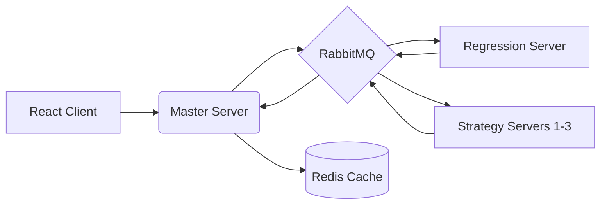

# 💸 Quantiva 2.0

### Distributed AI-Driven Portfolio Analysis System

> "If Quantiva 1.0 was a bright idea, v2.0 is that idea with industrial-grade infrastructure... here we also analyze social media data, geo-politics to help you understand your portfolio better then you could ever imagine!!"

## 🤓 The Engineering Challenge

The goal was to evolve a monolithic market analysis tool into a **distributed microservices ecosystem**. In this version, heavy financial computations and AI-driven sentiment analysis are parallelized across independent servers, orchestrated by a message broker.

## 🏗️ System Architecture

Quantiva 2.0 runs as a fleet of specialized nodes. Instead of one process doing everything, the work is split:

- **Master Node:** The orchestrator. It manages the lifecycle of an analysis request, caches results in **Redis**, and serves the UI.

- **Strategy Cluster:** Independent servers (Regression, Momentum, Mean Reversion, and Geopolitics) that consume tasks from the queue.

- **Message Broker:** **RabbitMQ** acts as the central nervous system, ensuring fault-tolerant communication between services.




## 💡 Engineering Wins (Why this matters)

- **56% Efficiency Boost:** By migrating to a modular microservices architecture, I significantly reduced system latency.
- **Fault Tolerance:** Using a message-driven approach means if one strategy server goes down, the rest of the system stays alive.
- **AI Reasoning:** Integrated **Gemini 2.0** to transform messy geopolitical news into structured market signals.
- **Optimized Infrastructure:** Reduced costs by 23% by moving away from heavy CMS dependencies to lean, custom Node.js APIs.


## 🧰 Tech Stack

- **Runtime:** Node.js, Express.js 
- **Data:** PostgreSQL (Prisma), Redis (Caching) 
- **Distributed:** RabbitMQ (Task Queue), Docker 
- **AI:** Gemini 2.0 (LLM) 


---

## 📦 Local Setup & Installation

To run the full ecosystem, you must have **RabbitMQ** and **Redis** running locally.

### 1. Prerequisites

```bash
# Ensure RabbitMQ and Redis are active
brew services start rabbitmq
brew services start redis

```

### 2. Launch the Ecosystem

Each component requires its own terminal instance to simulate a distributed environment:

```bash
# Terminal 1: Master Server
cd servers/master && node index.js

# Terminal 2: Regression Server
cd servers/regression_server && node index.js

# Terminal 3+: Strategy Servers
cd servers/strategy_1 && node index.js

# Terminal frontend
cd CLIENT/app && npm run dev
```

### Preview:


<p align="center">
<br/><br/>
  

  
  <br/><br/>
  

  
</p>


