# ⚡ Quantiva 2.0 — Distributed AI-Driven Portfolio Analysis System

> *"If Quantiva 1.0 was a bright idea, Quantiva 2.0 is that idea with infrastructure, message queues, and caffeine."*

---

## 🧭 Overview

Quantiva 2.0 is the evolved version of [**Quantiva 1.0**](https://github.com/mdrayaanpasha/quantiva) — a system that initially focused on **geopolitical and regression-based market analysis** in a single-server setup.

This version takes the same core idea and scales it into a **multi-server distributed ecosystem**, integrating multiple financial strategies, real-time communication via **RabbitMQ**, and **AI-driven geopolitical sentiment analysis** through the Gemini API.

In short: it’s smarter, faster, modular, and actually behaves like a system built for production (most days).

---

## 🧩 System Architecture

Quantiva 2.0 consists of multiple independently running servers — each designed to perform a specialized analysis — coordinated through message queues and aggregated by a master node.

```mermaid
graph TD
    subgraph User
        UI(React Frontend)
    end

    subgraph Master Node
        Master(Master Server)
        Cache[(Redis Cache)]
    end

    subgraph Message Queue
        MQ([RabbitMQ])
    end

    subgraph Strategy Servers
        S1(🧮 Regression Server)
        S2(📊 Strategy 1 Server)
        S3(📉 Strategy 2 Server)
        S4(🌍 Geo-Politics Server)
    end

    subgraph AI
        AI_API(🤖 Gemini API)
    end

    subgraph Database
        DB[(PostgreSQL)]
    end

    UI -- HTTP Request --> Master
    Master -- Publishes Job --> MQ
    MQ -- Distributes Tasks --> S1
    MQ -- Distributes Tasks --> S2
    MQ -- Distributes Tasks --> S3
    MQ -- Distributes Tasks --> S4

    S1 --> DB
    S4 -- Calls --> AI_API
    
    S1 -- Pushes Result --> MQ
    S2 -- Pushes Result --> MQ
    S3 -- Pushes Result --> MQ
    S4 -- Pushes Result --> MQ

    MQ -- Sends Results --> Master
    Master -- Stores in --> Cache
    Master -- Sends Report --> UI
```



| Server | Function | Core Tech |
|--------|-----------|-----------|
| 🧮 **Regression Server** | Runs linear regression analysis on historical price data | Node.js, Prisma ORM |
| 📊 **Strategy 1** | Moving-average-based momentum strategy | Node.js |
| 📉 **Strategy 2** | Mean-reversion strategy | Node.js |
| 🌍 **Strategy 3 – Geo Politics** | Analyzes sentiment and global events via Gemini API | Node.js, Axios |
| 🧠 **Master Server** | Aggregates all strategy outputs and finalizes decisions | Node.js, Redis, RabbitMQ |

Each server communicates asynchronously via **RabbitMQ**, caches data through **Redis**, and sends unified analytical output to the **Master Server**, which consolidates final investment recommendations.

---

## 🧠 Core Functionality

- Create and manage a **user portfolio**.  
- Perform **unified and per-company analysis** across multiple strategies.  
- Integrate **geopolitical sentiment, social media signals, and regression trends**.  
- Aggregate and interpret results through the Master Server for final decision output.

---

## 🧰 Tech Stack

| Layer | Technology | Purpose |
|-------|-------------|----------|
| **Frontend** | React (JSX) | Portfolio creation and analysis dashboard |
| **Backend** | Node.js + Express | RESTful services for data and coordination |
| **ORM** | Prisma | Type-safe database interactions |
| **Cache** | Redis | High-speed caching and message buffering |
| **Message Broker** | RabbitMQ | Inter-service communication and orchestration |
| **AI API** | Gemini 2.0 | Real-time geopolitical & sentiment reasoning |
| **Database** | PostgreSQL | Core data persistence layer |

---

## 🧮 How It Works

1. The user submits a portfolio.  
2. Each strategy server performs its independent analysis:
   - Regression models,
   - Moving average signals,
   - Mean reversion trends,
   - Geo-political and sentiment insights from Gemini AI.  
3. Results are pushed to **RabbitMQ** queues.  
4. The **Master Server** listens, aggregates responses, and produces a consolidated decision report.

---

## 📦 Installation & Setup

```bash
# Clone the repo
git clone https://github.com/mdrayaanpasha/quantiva_2.0.git
cd quantiva_2.0

# Install dependencies
npm install

# Create .env file and add your Gemini API key
GEMINI_API_KEY=your_api_key_here

# Start the system
npm run start
````

Ensure RabbitMQ and Redis are running locally before launching the servers.

---

## 🧠 Example Output

```bash
📈 Gemini Decision Response:
AAPL: STRONG
TSLA: AVERAGE
AMZN: WEAK

🧩 Reasoning:
AAPL surged due to easing of export restrictions.
TSLA sentiment mixed following CEO media coverage.
AMZN weakened amid logistics and labor headwinds.
```

---

## 🚀 Key Improvements from Quantiva 1.0

| Feature        | v1.0                      | v2.0                                |
| -------------- | ------------------------- | ----------------------------------- |
| Architecture   | Single-server monolith    | Distributed multi-server model      |
| Strategies     | Geopolitical + Regression | Multiple modular trading strategies |
| Communication  | Internal function calls   | Asynchronous queues (RabbitMQ)      |
| Caching        | None                      | Redis caching layer                 |
| AI Integration | Basic Gemini API          | Advanced prompt-driven reasoning    |
| Scalability    | Limited                   | Horizontal scaling per strategy     |

---

## 🔍 Highlights for Reviewers

* Designed and implemented a **multi-service distributed trading architecture**.
* Integrated **Gemini AI** for real-time geopolitical and sentiment analysis.
* Optimized inter-service performance with **Redis caching** and **RabbitMQ queues**.
* Modularized trading strategies for experimentation and extensibility.
* Developed a **React-based interface** for user portfolio visualization.

*(Built with careful design, practical engineering, and the occasional debugging existential crisis.)*

---

## 📅 Future Roadmap

* [ ] Integrate LSTM-based price prediction models.
* [ ] Add real-time data streaming and WebSocket updates.
* [ ] Dockerize each service for scalable deployment.
* [ ] Expand sentiment sources beyond Gemini (Reddit + X).
* [ ] Add analytics dashboard for performance metrics.

---

## 🧾 Related Project

> **Quantiva 1.0** → [https://github.com/mdrayaanpasha/quantiva](https://github.com/mdrayaanpasha/quantiva)
> The origin of the concept: a simple, single-server prototype running regression and geopolitical analysis — the foundation that inspired this distributed evolution.

---

## 🧑‍💻 Author

**[Rayaan Pasha](https://github.com/mdrayaanpasha)**
*Engineer • AI enthusiast • Probably over-engineering something right now.*

---

**Quantiva 2.0** — where data meets design, and every server thinks it’s the smartest one.


